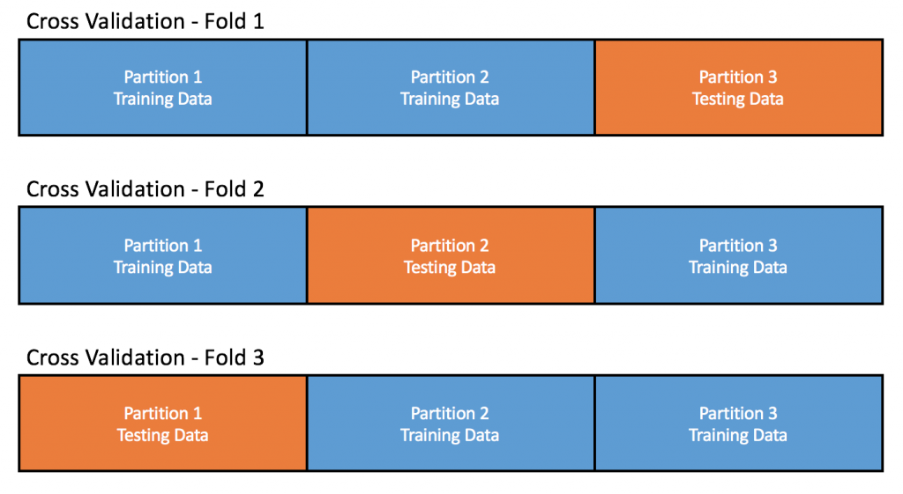
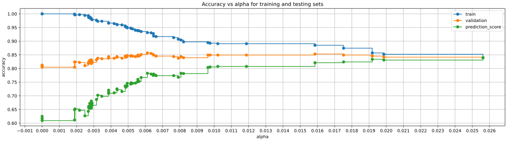
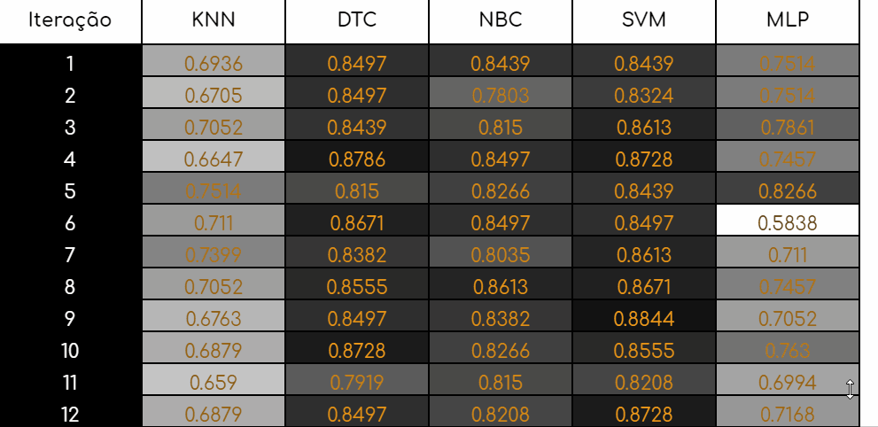

<h1 align="center">Trabalho 1 - Aprendizagem de Máquina</h1>

## Andre Brun
### Daniel Boll & Mateus Karvat
---
## Base: Australian

A base de dados Australian é composta por informações de pedidos de aprovação de crédito. Ela contém atributos de diferentes tipos (numéricos, categóricos) e com diferentes intervalos de valores. A fim de manter anonimização de dados, o nome de cada atributo foi omitido na criação da base de dados.

## Dados: 
    A1:	0,1    CATEGORICAL
        a,b
    A2:	continuous.
    A3:	continuous.
    A4:	1,2,3         CATEGORICAL
        p,g,gg
    A5:  1, 2,3,4,5, 6,7,8,9,10,11,12,13,14    CATEGORICAL
         ff,d,i,k,j,aa,m,c,w, e, q, r,cc, x 
         
    A6:	 1, 2,3, 4,5,6,7,8,9    CATEGORICAL
        ff,dd,j,bb,v,n,o,h,z 

    A7:	continuous.
    A8:	1, 0       CATEGORICAL
        t, f.
    A9: 1, 0	    CATEGORICAL
        t, f.
    A10:	continuous.
    A11:  1, 0	    CATEGORICAL
          t, f.
    A12:    1, 2, 3    CATEGORICAL
            s, g, p 
    A13:	continuous.
    A14:	continuous.
    A15:   1,2
           +,-         (class attribute)

---
Importaremos as bibliotecas necessárias para análise, extração e manipulação dos dados.

Para isso, iremos inicialmente fazer a instalação das bibliotecas necessárias utilizando o `pip`.


```python
!pip install pandas
!pip install seaborn
!pip install sklearn
!pip install pandoc
```

Após termos instalado as bibliotecas, importaremos as funções e bibliotecas necessárias


```python
import pandas as pd
import numpy as np
import seaborn as sns
import matplotlib.pyplot as plt
import matplotlib.ticker as tic
import plotly.graph_objects as go
from plotly.colors import n_colors
import time
import copy
import operator
np.set_printoptions(precision=3, suppress=True)
# %matplotlib notebook
# %matplotlib inline

# Analitics
from sklearn import metrics
from sklearn.model_selection import train_test_split, GridSearchCV, StratifiedKFold
from sklearn.metrics import classification_report, confusion_matrix, accuracy_score
from sklearn.preprocessing import normalize, StandardScaler
from sklearn.pipeline import make_pipeline
from scipy.stats import kruskal, mannwhitneyu

# Classifiers
from sklearn.neighbors import KNeighborsClassifier, DistanceMetric, NearestNeighbors
from sklearn.naive_bayes import GaussianNB, MultinomialNB, ComplementNB, BernoulliNB, CategoricalNB
from sklearn.neural_network import MLPClassifier
from sklearn.tree import DecisionTreeClassifier, plot_tree
from sklearn.svm import SVC

# Utilities
from utils.func import class_distribution, draw_missing_data_table
```

Utilizando o pandas iremos extrair as informações da base da dados `australian.csv`


```python
columns = ('A1', 'A2', 'A3', 'A4', 'A5', 'A6', 'A7', 'A8', 'A9', 'A10', 'A11', 'A12', 'A13', 'A14', 'Class')
data = pd.read_csv('./australian.csv', names=columns)

# Manteremos uma cópia dos dados originais
# para garantia
raw_data = data.copy()
```


```python
columns = ('A1', 'A2', 'A3', 'A4', 'A5', 'A6', 'A7', 'A8', 'A9', 'A10', 'Class')
data = pd.read_csv('./ILPD.csv', names=columns)

# Manteremos uma cópia dos dados originais
# para garantia
raw_data = data.copy()
```


```python
# Visualizando as informações
data.head()
```


<div>
<style scoped>
    .dataframe tbody tr th:only-of-type {
        vertical-align: middle;
    }

    .dataframe tbody tr th {
        vertical-align: top;
    }

    .dataframe thead th {
        text-align: right;
    }
</style>
<table border="1" class="dataframe">
  <thead>
    <tr style="text-align: right;">
      <th></th>
      <th>A1</th>
      <th>A2</th>
      <th>A3</th>
      <th>A4</th>
      <th>A5</th>
      <th>A6</th>
      <th>A7</th>
      <th>A8</th>
      <th>A9</th>
      <th>A10</th>
      <th>Class</th>
    </tr>
  </thead>
  <tbody>
    <tr>
      <th>0</th>
      <td>-0.171086</td>
      <td>0.568362</td>
      <td>1.287481</td>
      <td>1.694323</td>
      <td>-0.320570</td>
      <td>-0.114929</td>
      <td>0.266358</td>
      <td>0.383910</td>
      <td>-0.435058</td>
      <td>5.891406</td>
      <td>1</td>
    </tr>
    <tr>
      <th>1</th>
      <td>-0.607191</td>
      <td>0.568362</td>
      <td>-0.428896</td>
      <td>-0.472286</td>
      <td>-0.387550</td>
      <td>-0.214802</td>
      <td>-0.279736</td>
      <td>0.291803</td>
      <td>0.328531</td>
      <td>0.169498</td>
      <td>1</td>
    </tr>
    <tr>
      <th>2</th>
      <td>-1.167897</td>
      <td>-1.765125</td>
      <td>-0.445400</td>
      <td>-0.472286</td>
      <td>-0.621981</td>
      <td>-0.381256</td>
      <td>-0.272735</td>
      <td>-0.721372</td>
      <td>-0.944117</td>
      <td>-0.625211</td>
      <td>1</td>
    </tr>
    <tr>
      <th>3</th>
      <td>0.389620</td>
      <td>0.568362</td>
      <td>0.115724</td>
      <td>0.372324</td>
      <td>-0.065207</td>
      <td>1.671683</td>
      <td>0.770444</td>
      <td>0.936551</td>
      <td>1.092119</td>
      <td>0.487382</td>
      <td>1</td>
    </tr>
    <tr>
      <th>4</th>
      <td>-0.420289</td>
      <td>0.568362</td>
      <td>-0.263860</td>
      <td>-0.178509</td>
      <td>-0.462903</td>
      <td>-0.347965</td>
      <td>-0.265733</td>
      <td>0.660230</td>
      <td>0.583060</td>
      <td>0.169498</td>
      <td>1</td>
    </tr>
  </tbody>
</table>
</div>


Próximo passo é nos certificarmos que a base de dados não tem dados faltantes, então chamamos a função `draw_missing_data_table` que permite-nos averiguar quantos dados estão faltando por coluna


```python
draw_missing_data_table(data)
```


<div>
<style scoped>
    .dataframe tbody tr th:only-of-type {
        vertical-align: middle;
    }

    .dataframe tbody tr th {
        vertical-align: top;
    }

    .dataframe thead th {
        text-align: right;
    }
</style>
<table border="1" class="dataframe">
  <thead>
    <tr style="text-align: right;">
      <th></th>
      <th>Total</th>
      <th>Percent</th>
    </tr>
  </thead>
  <tbody>
    <tr>
      <th>Class</th>
      <td>0</td>
      <td>0.0</td>
    </tr>
    <tr>
      <th>A10</th>
      <td>0</td>
      <td>0.0</td>
    </tr>
    <tr>
      <th>A9</th>
      <td>0</td>
      <td>0.0</td>
    </tr>
    <tr>
      <th>A8</th>
      <td>0</td>
      <td>0.0</td>
    </tr>
    <tr>
      <th>A7</th>
      <td>0</td>
      <td>0.0</td>
    </tr>
    <tr>
      <th>A6</th>
      <td>0</td>
      <td>0.0</td>
    </tr>
    <tr>
      <th>A5</th>
      <td>0</td>
      <td>0.0</td>
    </tr>
    <tr>
      <th>A4</th>
      <td>0</td>
      <td>0.0</td>
    </tr>
    <tr>
      <th>A3</th>
      <td>0</td>
      <td>0.0</td>
    </tr>
    <tr>
      <th>A2</th>
      <td>0</td>
      <td>0.0</td>
    </tr>
    <tr>
      <th>A1</th>
      <td>0</td>
      <td>0.0</td>
    </tr>
  </tbody>
</table>
</div>


Em seguida, criaremos a separação utilizando o `train_test_split`.

O que acontece é que no caso de alguns classificadores, utilizaremos uma função da biblioteca SciKit-Learn para realizar o ***GridSearch***, a `GridSearchCV` a qual já realiza a separação do conjunto de validação do conjunto de treino pelo método 3-Fold. Logo, para estes casos realizaremos a seguinte separação:

 - 75% treino
    - GridSearchCV vai separar em
        - treino
        - validação
 - 25% teste

Já para os classificadores nos quais o ***GridSearch*** será realizado manualmente necessitaremos da separação manual do conjunto de validação, logo faremos:

 - 50% treino
 - 25% teste
 - 25% validação

Para esta distribuição, separa-se o conjunto de treino (75%) da distribuição anterior entre um conjunto de treino menor (50%) e um conjunto de validação (25%). Assim, o conjunto de teste mantém-se o mesmo.

Tendo isso em vista, o treino dos classificadores após a realização do ***GridSearch*** ocorre com o conjunto de treino menor (50%), visto que o conjunto de validação já foi utilizado na busca de parâmetros e não deve ser utilizado para fins de treinamento.


```python
def split(data):
    # Separamos todos os atributos com excessão da classe
    # Ex: (A1, A2, Classe)
    # data_param = (A1, A2)
    data_param = pd.DataFrame(data, columns=data.columns[:-1])

    # Utilizamos o train_test_split deixando
    # 75% da base no treino e 25% no teste
    # e utilizamos o stratify que tenta manter
    # a proporção das classes durante a separação
    train75_data, test_data, train75_classes, test_classes = train_test_split(data_param, data['Class'], test_size=0.25, stratify=data['Class'])

    # Depois fazemos a cópia do 75
    # Para a variável que armazenará
    # 50% do treino
    train50_data = train75_data
    train50_classes = train75_classes

    # fazemos a separação, novamento utilizando
    # o stratify, mantendo a proporção da origem
    # que agora não é mais os dados completos e sim
    # do train 75
    train50_data, validation_data, train50_classes, validation_classes = train_test_split(train75_data, train75_classes, test_size=0.333333, stratify=train75_classes)

    # Retornamos os valores
    return [train75_data, train75_classes, test_data, test_classes, train50_data, train50_classes, validation_data, validation_classes]
```


```python
train75_data, train75_classes, test_data, test_classes, train50_data, train50_classes, validation_data, validation_classes = split(data)

m = np.shape(train75_data)[1]
```

A fim de melhorar a realização do **GridSearch** manual, isto é, o **GridSearch** que não utiliza a biblioteca SciKit-Learn, criamos a função `custom_kfold` para realizar esta operação utilizando a técnica de K-Fold.

</img>


```python
print("Train 75: \n")
class_distribution(train75_classes)
print('-----------')
print(f"Train 50: \n")
class_distribution(train50_classes)
print('-----------')
print(f"Test: \n")
class_distribution(test_classes)
print('-----------')
print(f"Validation: \n")
class_distribution(validation_classes)
```

    Train 75: 
    
    Classe 1: 312 elementos
    Classe 2: 125 elementos
    -----------
    Train 50: 
    
    Classe 1: 208 elementos
    Classe 2: 83 elementos
    -----------
    Test: 
    
    Classe 2: 42 elementos
    Classe 1: 104 elementos
    -----------
    Validation: 
    
    Classe 1: 104 elementos
    Classe 2: 42 elementos
    


```python
def custom_kfold():

    kfold_dictionary = {
        "kfold_train_classes": [],
        "kfold_train_data": [],
        "kfold_validation_classes": [],
        "kfold_validation_data": []
    }

    kf = StratifiedKFold(n_splits=3)
    current_folding = 0
    for train_index, validation_index in kf.split(train75_data, train75_classes):
        n_train_fold = np.shape(train_index)[0]
        n_validation_fold = np.shape(validation_index)[0]

        kfold_train_classes = np.zeros((n_train_fold, 1))
        kfold_train_data =  np.zeros((n_train_fold, m))
        kfold_validation_classes = np.zeros((n_validation_fold, 1)) 
        kfold_validation_data = np.zeros((n_validation_fold, m))

        j = 0 
        for i in train_index:
            kfold_train_data[j] = train75_data.values[i, :]
            kfold_train_classes[j] = train75_classes.values[i]
            j += 1  

        h = 0 
        for i in validation_index:
            kfold_validation_data[h] = train75_data.values[i, :]
            kfold_validation_classes[h] = train75_classes.values[i]
            h += 1

        kfold_dictionary['kfold_train_classes'].append(kfold_train_classes)
        kfold_dictionary['kfold_train_data'].append(kfold_train_data)
        kfold_dictionary['kfold_validation_classes'].append(kfold_validation_classes)
        kfold_dictionary['kfold_validation_data'].append(kfold_validation_data)

    return kfold_dictionary
```

----
## KNN (K-Nearest Neighbors)
### Definição de métricas personalizadas

As ponderações possíveis dentro do KNeighborsClassifier são:

- Uniform
    - Pesos uniformes. Todos os pontos em cada bairro são ponderados igualmente. (Padrão)
- Distance
    - Pontos de ponderação pelo inverso de sua distância. Neste caso, vizinhos mais próximos de um ponto de consulta terão uma influência maior do que vizinhos mais distantes.
- Callable
    - Uma função customizável para a ponderação, que seguirá a fórmula $P_i=1-DE_{i->teste}Normalizada$ 
onde, para normalizar, utilizamos:

$$V_i=\frac{V_i-V_{mínimo}}{V_{máximo}-V_{mínimo}}$$ 


```python
# Normalização
def to_normalized(distances):
    t_max = max(distances)
    t_min = min(distances)
    distances = distances - t_min
    distances = distances / (t_max - t_min)
    return distances

# 1 - DEnormalizada
def one_minus_d_euclid(k_distance):
    # A função recebe os k mais próximos
    # e precisa retornar a ponderação desses
    # o correto seria se fazer a normalização
    # global, contudo como não temos acesso a 
    # tudo, normalizaremos com base nesses k

    weights = np.zeros(np.shape(k_distance))

    # Caso seja k = 1 a ponderação será sempre 1
    if np.shape(k_distance)[1] == 1:
        weights = np.ones(np.shape(k_distance))
    # Caso k >= 2 normalizaremos cada linha
    else:
        for i in range(np.shape(k_distance)[0]):
            weights[i] = to_normalized(np.array(k_distance[i]))

    # E retornamos uma lista de mesmo tamanho
    # ponderada
    return weights
```

A função getBestKNN realiza a operação de ***GridSearch*** utilizando a função do `SciKit-Learn`. Ela testa os parâmetros:

- *n_neighbors*: valor do parâmetro **k**.
  - variando de 1 a 99 com incrementos de 2 (pois números de k pares tendem a empatar);

- *weights*: métrica de distância.
  - varia entre as três possibilidades citadas acima;

- *metric*: é fixada como "euclidean" para que o classificador sempre utilize a distância euclidiana entre os pontos.


```python
def getBestKNN():
    # Grid search
    knn_parameters = {
        'n_neighbors': range(1, 100, 2),
        'weights': ('distance', 'uniform', one_minus_d_euclid),
        'metric': ['euclidean']
    }

    knnGS = GridSearchCV(KNeighborsClassifier(), knn_parameters, cv=3)
    knnGS.fit(train75_data, train75_classes)
    best_params_knn = knnGS.best_params_
    print(f"KNN best params: {best_params_knn}")
    
    # KNN with the best parameters
    return KNeighborsClassifier(
                n_neighbors=best_params_knn['n_neighbors'],
                metric=best_params_knn['metric'],
                weights=best_params_knn['weights']
            )
```

-----
## DTC (Decision Tree Classifier)

A árvore de decisão pode ocorrar com poda ou sem poda. Para este classificador, realizamos GridSearch manualmente, utilizando a função `custom_kfold`.

A poda é realizada buscando pelo melhor parâmetro `ccp_alpha` (cost complexity parameter), o qual define os locais de poda da árvore com base no custo de complexidade de cada nó.

Na busca pelo melhor `ccp_alpha`, definimos uma variável chamada de prediction_vector, o qual é definido como o valor das acurácias no conjunto de validação de para cada possível valor de `ccp_alpha`, subraída da diferença entre a acurácia do conjunto de treino com o conjunto de validação.



Graficamente, o valor de `ccp_alpha` ideal é aquele no qual a linha laranja tem o valor mais alto possível, desde que a distância dela até a linha azul seja pequena. Caso a distância da linha laranja até a linha azul seja grande, o classificador sofrerá com *overfitting*. Logo, a variável `prediction_score` é definida de modo a penalizar as acurácias de validação pelo *gap* da validação ao treino. Assim, pode-se selecionar o `ccp_alpha` com o maior valor de `prediction_score` e obter a árvore com a melhor poda.

No gráfico acima, é possível observar que o maior valor de acurácia para o conjunto de validação está próximo a `ccp_alpha` igual a 0.006. Entretanto, para tal valor de `ccp_alpha` ocorreria um *overfit* significativo dado que o *gap* entre as linhas laranja e azul é acentuado. Nesse sentido, o melhor valor de `ccp_alpha` é o valor mais alto de `prediction_score`, que ocorre próximo a `ccp_alpha` igual a 0.026. Para tal valor, a acurácia do conjunto de validação não é a mais alta, mas está apenas ligeiramente abaixo do valor mais alto. Em contrapartida, o *gap* entre as linhas laranja e azul é mínimo, visto que convergiram num mesmo ponto. Nesse sentido, tal valor de `ccp_alpha` representará o melhor resultado no conjunto de testes.


```python
def getBestDTC():
    # Sem poda
    dtc = DecisionTreeClassifier()
    dtc.fit(train50_data, train50_classes)

    kfold_dtc = custom_kfold()
    ccp_alphas = []

    # Criação das árvores de cada fold a fim de determinar todos os possíveis valores de ccp_alpha
    for i in range(0, 3):
        kfold_train_data = kfold_dtc['kfold_train_data'][i]
        kfold_train_classes = kfold_dtc['kfold_train_classes'][i]

        path = dtc.cost_complexity_pruning_path(kfold_train_data, kfold_train_classes)
        temp = path.ccp_alphas
        ccp_alphas = np.concatenate((ccp_alphas, temp), axis=0)  

    ccp_alphas = np.sort(ccp_alphas)     

    # Verificação dodesempenho do classificador com diferentes valores para o ccp_alpha
    cut = 6 - 0
    train_scores_mean = np.zeros(np.shape(ccp_alphas)[0]-cut)
    val_scores_mean = np.zeros(np.shape(ccp_alphas)[0]-cut)

    for i in range(0, 3):
        kfold_train_data = kfold_dtc['kfold_train_data'][i]
        kfold_train_classes = kfold_dtc['kfold_train_classes'][i]
        kfold_validation_data = kfold_dtc['kfold_validation_data'][i]
        kfold_validation_classes = kfold_dtc['kfold_validation_classes'][i]

        dtcs = []
        for ccp_alpha in ccp_alphas:
            Prundtc = DecisionTreeClassifier(ccp_alpha=ccp_alpha)
            Prundtc.fit(kfold_train_data, kfold_train_classes)
            dtcs.append(Prundtc)

        dtcs = dtcs[:-cut]
        ccp_alphas_m = copy.deepcopy(ccp_alphas)
        ccp_alphas_m = ccp_alphas_m[:-cut]

        train_scores = [dtc.score(kfold_train_data, kfold_train_classes) for dtc in dtcs]
        val_scores = [dtc.score(kfold_validation_data, kfold_validation_classes) for dtc in dtcs]

        train_scores_mean += train_scores
        val_scores_mean += val_scores

    train_scores_mean /= 3
    val_scores_mean /= 3

    # A partir das acurácias de treino e validação para cada possível valor de ccp_alpha, criamos o prediction_vector, o qual possibilita a escolha automática do melhor ccp_alpha
    prediction_vector = np.zeros(np.shape(val_scores_mean))
    prediction_vector = 2 * val_scores_mean - train_scores_mean

    best_candidate = np.argmax(prediction_vector)


    dtcP = DecisionTreeClassifier(ccp_alpha=ccp_alphas[best_candidate])
    dtcP.fit(train50_data, train50_classes)

    # Determinar o melhor
    dtcPred = dtc.predict(validation_data) # Pruned's.less
    dtcPPred = dtcP.predict(validation_data) # Pruned

    dtcAcc  = accuracy_score(validation_classes, dtcPred)
    dtcPAcc = accuracy_score(validation_classes, dtcPPred)

    if dtcPAcc > dtcAcc:
        print(f"DTC best params: com poda")        
        return DecisionTreeClassifier(ccp_alpha=ccp_alphas[best_candidate])

    print(f"DTC best params: sem poda")       
    return DecisionTreeClassifier()
```

---
## NBC (Naive Bayes Classifier)

Para o classificador Naive Bayes, há diferentes funções no SciKit-Learn que implementam este classificador, com diferentes variações. A fim de utilizar o melhor classificador possível, realizamos um **GridSearch** manual com a função `custom_kfold` testando cada um dos possíveis classificadores existentes na biblioteca, sendo eles:

- *Gaussian* Naive Bayes
- *Multinomial* Naive Bayes
- *Complemente* Naive Bayes
- *Bernoulli* Naive Bayes


```python
gnb = GaussianNB()
mnb = MultinomialNB()
cnb = ComplementNB()
bnb = BernoulliNB()
```

A função `getBestNBC` realiza o **GridSearch** manual dentre os diferentes tipos de classificador Naive Bayes e retorna aquele com os melhores resultados.


```python
def getBestNBC():
    accuracies = {'GNB': [], 'MNB': [], 'CNB': [], 'BNB': []}
    average_accuracies = {'GNB': 0, 'MNB': 0, 'CNB': 0, 'BNB': 0}
    kfold_nb = custom_kfold()
    # Grid Search
    for i in range(0, 3):
        kfold_train_data = kfold_nb['kfold_train_data'][i]
        kfold_train_classes = kfold_nb['kfold_train_classes'][i]
        kfold_validation_data = kfold_nb['kfold_validation_data'][i]
        kfold_validation_classes = kfold_nb['kfold_validation_classes'][i]

        ## ------- GaussianNB ------- ## 
        gnb.fit(kfold_train_data, kfold_train_classes)
        gnbPred = gnb.predict(kfold_validation_data)
        accuracies['GNB'].append(accuracy_score(kfold_validation_classes, gnbPred))

        ## ------- MultinomialNB ------- ## 
        mnb.fit(kfold_train_data, kfold_train_classes)
        mnbPred = mnb.predict(kfold_validation_data)
        accuracies['MNB'].append(accuracy_score(kfold_validation_classes, mnbPred))

        ## ------- ComplementNB ------- ## 
        cnb.fit(kfold_train_data, kfold_train_classes)
        cnbPred = cnb.predict(kfold_validation_data)
        accuracies['CNB'].append(accuracy_score(kfold_validation_classes, cnbPred))

        ## ------- BernoulliNB ------- ## 
        bnb.fit(kfold_train_data, kfold_train_classes)
        bnbPred = bnb.predict(kfold_validation_data)
        accuracies['BNB'].append(accuracy_score(kfold_validation_classes, bnbPred))
    
    for classificator in accuracies:
        average_accuracies[classificator] = np.average(accuracies[classificator])

    # The best params
    bestNB_classifier = max(average_accuracies, key=average_accuracies.get)
    NB_classifiers = {
        'GNB': GaussianNB(), 
        'MNB': MultinomialNB(), 
        'CNB': ComplementNB(), 
        'BNB': BernoulliNB()
    }

    Bestnb = NB_classifiers[bestNB_classifier]

    print(f"best NB: {bestNB_classifier}")
    return Bestnb
```

-----------------------------
## SVM (Support Vector Machine)

No classificador SVM, utizamos a função de **GridSearch** do SciKit-Learn, realizando a busca pelos seguintes parâmetros:

- C: Valor de erro
  - variando de $10^{-3}$ a $10^3$ em escala polinomial (ou seja, com incremento do expoente)

- Kernel: Polinomial ou Radial

- Probabilidade: Definido como verdadeiro a fim de sempre retornar as probabilidades de cada classe ao se utilizar a função `predict_proba`


```python
def getBestSVM():
    # Grid search
    svm_parameters = {
        'svc__C': np.logspace(-3, 3, 7),
        'svc__kernel': ('poly', 'rbf'),
        'svc__probability': [True]
    }

    svm_pipeline = make_pipeline(StandardScaler(), SVC())
    svmGS = GridSearchCV(svm_pipeline, svm_parameters, cv=3)
    svmGS.fit(train75_data, train75_classes)
    svmBestParams = svmGS.best_params_
    print(f"Best svm params: {svmBestParams}")
    # SVM with the best parameters
    return make_pipeline(StandardScaler(), SVC(
        C=svmBestParams['svc__C'],
        kernel=svmBestParams['svc__kernel'],
        probability=svmBestParams['svc__probability']
    ))
```

---
## MLP (MultiLayer Perceptron)

No MultilayerPerceptron, utilizamos a função de **GridSearch** do SciKit-Learn, buscando pelos seguintes parâmetros:

- hidden_layer_sizes: Tamanho de cada camada oculta e número de camadas ocultas;
- learnin_rate_init: Taxa de aprendizagem, variando entre 0.01 e 0.03;
- max_iter: Número de épocas de treino, variando de 100 a 500 com incrementos de 100.

A busca pelo parâmetro `hidden_layer_sizes` se deu utilizando a função `hidden_layers_generation`, definida abaixo. Nela, são geradas diferentes configurações de layers. O número de layers varia de 4 a 6, enquanto o número de nós na layer final varia de 256 a 512, sendo o número de nós crescente a cada nova layer por potências de 2.

Ou seja, as configurações de camadas obtidas são:

- 4 Layers
  -   [ 32,  64, 128, 256]
  -   [ 64, 128, 256, 512]
- 5 Layers
  -   [ 16,  32,  64, 128, 256]
  -   [ 32,  64, 128, 256, 512]
- 6 Layers
  -   [  8,  16,  32,  64, 128, 256]
  -   [ 16,  32,  64, 128, 256, 512]

Tendo em vista que o Classificador MLP leva um tempo elevado para realizar o GridSearch, durante a criação do código realizamos uma série de testes com um número ainda maior de valores para cada um dos parâmetros, definindo os parâmetros acima por se tratarem de parâmetros com maior incidência nos testes realizados. Parâmetros que nunca eram selecionados pelo GridSearch foram excluídos da busca final.


```python
def hidden_layers_generation():
    final_layer_config = []
    for i in range(4, 7):
        num_layers = i
        for j in range(8, 10):
            layer_temp = np.zeros((num_layers))
            for k in range(0,num_layers):
                layer_temp[k] = 2**(j-k)
            final_layer_config.append(layer_temp[::-1].astype(int))
            
    return final_layer_config
```


```python
hidden_layers_size = hidden_layers_generation()
math_iterators_learning_rate = (0.01, 0.03)
math_iterators_max_iter = range(100, 600, 100)
```


```python
def getBestMLP():
    # Grid search
    mlp_parameters = {
        'hidden_layer_sizes': hidden_layers_size,
        'learning_rate_init': math_iterators_learning_rate,
        'max_iter': math_iterators_max_iter
    }
    mlpGS = GridSearchCV(MLPClassifier(), mlp_parameters, cv=3, n_jobs=-1)
    mlpGS.fit(train75_data, train75_classes)
    # print(mlpBestParams)
    # print(mlpGS.best_score_)
    print(f"Best MLP params: {mlpGS.best_params_}")
    # MLP with the best parameters
    return MLPClassifier(
        hidden_layer_sizes=mlpGS.best_params_['hidden_layer_sizes'],
        learning_rate_init=mlpGS.best_params_['learning_rate_init'],
        max_iter=mlpGS.best_params_['max_iter']
    )
```

---
## SMC (Sistema de Múltiplos Classificadores)

A partir da definição dos classificadores individuais, são criados Classificadores Múltiplos com base nas técnicas de Soma, Produto e Borda Count.


```python
def SMCSoma(knnResult, dtcResult, svmResult, nbcResult):
    # KNN predictions
    knnpred0 = knnResult['pred_proba'][:, 0]
    knnpred1 = knnResult['pred_proba'][:, 1]

    # DTC predictions
    dtcpred0 = dtcResult['pred_proba'][:, 0]
    dtcpred1 = dtcResult['pred_proba'][:, 1]

    # SVM predictions
    svmpred0 = svmResult['pred_proba'][:, 0]
    svmpred1 = svmResult['pred_proba'][:, 1]

    # NBC predictions
    nbcpred0 = nbcResult['pred_proba'][:, 0]
    nbcpred1 = nbcResult['pred_proba'][:, 1]

    # MLP predictions
    mlppred0 = mlpResult['pred_proba'][:, 0]
    mlppred1 = mlpResult['pred_proba'][:, 1]

    # SMC prediction
    smcpred1 = knnpred1 + dtcpred1 + nbcpred1 + svmpred1 + mlppred1
    smcpred0 = knnpred0 + dtcpred0 + nbcpred0 + svmpred0 + mlppred0
    smcResult = np.greater(smcpred1, smcpred0)
    return accuracy_score(test_classes, smcResult) 
```


```python
def SMCProduto(knnResult, dtcResult, svmResult, nbcResult):
    # KNN predictions
    knnpred0 = knnResult['pred_proba'][:, 0]
    knnpred1 = knnResult['pred_proba'][:, 1]

    # DTC predictions
    dtcpred0 = dtcResult['pred_proba'][:, 0]
    dtcpred1 = dtcResult['pred_proba'][:, 1]

    # SVM predictions
    svmpred0 = svmResult['pred_proba'][:, 0]
    svmpred1 = svmResult['pred_proba'][:, 1]

    # NBC predictions
    nbcpred0 = nbcResult['pred_proba'][:, 0]
    nbcpred1 = nbcResult['pred_proba'][:, 1]

    # MLP predictions
    mlppred0 = mlpResult['pred_proba'][:, 0]
    mlppred1 = mlpResult['pred_proba'][:, 1]

    # SMC prediction
    smcpred1 = knnpred1 * dtcpred1 * nbcpred1 * svmpred1 * mlppred1
    smcpred0 = knnpred0 * dtcpred0 * nbcpred0 * svmpred0 * mlppred0
    smcResult = np.greater(smcpred1, smcpred0)
    return accuracy_score(test_classes, smcResult) 
```


```python
def SMCBC(knnResult, dtcResult, svmResult, nbcResult):
    # KNN predictions
    knnpred0 = knnResult['pred_proba'][:, 0]
    knnpred1 = knnResult['pred_proba'][:, 1]

    # DTC predictions
    dtcpred0 = dtcResult['pred_proba'][:, 0]
    dtcpred1 = dtcResult['pred_proba'][:, 1]

    # SVM predictions
    svmpred0 = svmResult['pred_proba'][:, 0]
    svmpred1 = svmResult['pred_proba'][:, 1]

    # NBC predictions
    nbcpred0 = nbcResult['pred_proba'][:, 0]
    nbcpred1 = nbcResult['pred_proba'][:, 1]

    # MLP predictions
    mlppred0 = mlpResult['pred_proba'][:, 0]
    mlppred1 = mlpResult['pred_proba'][:, 1]

    rankKNN = knnpred1 > 0.5
    rankDTC = dtcpred1 > 0.5
    rankNBC = nbcpred1 > 0.5
    rankSVM = svmpred1 > 0.5
    rankMLP = mlppred1 > 0.5

    # SMC prediction
    smcpred1 = rankKNN.astype(int) + rankDTC.astype(int) + rankNBC.astype(int) + rankSVM.astype(int) + rankMLP.astype(int)
    smcpred0 = 5 - smcpred1 # 5 if mlp 
    smcResult = np.greater(smcpred1, smcpred0).astype(int)
    return accuracy_score(test_classes, smcResult) 
```

---
## Teste

A fim de realizar 20 iterações de teste, definimos as funções auxiliares `getClassifPred`, que retorna as probabilidades de um classificador `clf`, e `splitEveryTime` que realiza uma nova distribuição do conjunto de treino.


```python
def getClassifPred(clf):
    clf.fit(train50_data, train50_classes)
    return {
        'pred_proba': clf.predict_proba(test_data),
        'acc': accuracy_score(test_classes, clf.predict(test_data))
        }
```


```python
def splitEveryTime():
    global train75_data
    global train75_classes
    global test_data
    global test_classes
    global train50_data
    global train50_classes
    global validation_data
    global validation_classes

    train75_data, train75_classes, test_data, test_classes, train50_data, train50_classes, validation_data, validation_classes = split(data)
```

Ao realizar as 20 iterações de teste, cada uma delas retorna quais foram os melhores parâmetros para aquele classificador em específico.


```python
accuracies = {
    'KNN': [],
    'DTC': [],
    'NBC': [],
    'SVM': [],
    'MLP': [],
    'SMCSoma': [],
    'SMCProduto': [],
    'SMCBC': [],
    }

for i in range(0, 20):
    print(f"Current iteration {i+1}")
    # Split, once again, the data
    splitEveryTime()

    # Grid Search
    knn = getBestKNN() 
    dtc = getBestDTC()
    nbc  = getBestNBC()
    svm = getBestSVM()
    mlp = getBestMLP()

    # Ask for the classificators to predict over
    # test
    knnResult = getClassifPred(knn)
    dtcResult = getClassifPred(dtc)
    nbcResult = getClassifPred(nbc)
    svmResult = getClassifPred(svm)
    mlpResult = getClassifPred(mlp)

    # Create the accuracies table
    accuracies['KNN'].append(knnResult['acc'])
    accuracies['DTC'].append(dtcResult['acc'])
    accuracies['NBC'].append(nbcResult['acc'])
    accuracies['SVM'].append(svmResult['acc'])
    accuracies['MLP'].append(mlpResult['acc'])
    accuracies['SMCSoma'].append(SMCSoma(knnResult, dtcResult, svmResult, nbcResult))
    accuracies['SMCProduto'].append(SMCProduto(knnResult, dtcResult, svmResult, nbcResult))
    accuracies['SMCBC'].append(SMCBC(knnResult, dtcResult, svmResult, nbcResult))
    print("-----------------------------------")

# accuracies
```

    Current iteration 0
    KNN best params: {'metric': 'euclidean', 'n_neighbors': 39, 'weights': 'uniform'}
    DTC best params: com poda
    best NB: BNB
    Best svm params: {'svc__C': 0.001, 'svc__kernel': 'poly', 'svc__probability': True}
    Best MLP params: {'hidden_layer_sizes': array([  8,  16,  32,  64, 128, 256]), 'learning_rate_init': 0.03, 'max_iter': 300}
    -----------------------------------
    Current iteration 1
    KNN best params: {'metric': 'euclidean', 'n_neighbors': 25, 'weights': 'uniform'}
    DTC best params: com poda
    best NB: BNB
    Best svm params: {'svc__C': 0.001, 'svc__kernel': 'poly', 'svc__probability': True}
    Best MLP params: {'hidden_layer_sizes': array([  8,  16,  32,  64, 128, 256]), 'learning_rate_init': 0.03, 'max_iter': 500}
    -----------------------------------
    

---
## Tabelas

São geradas as tabelas de acurácias dos classificadores individuais e dos classificadores múltiplos.


```python
accuracies['KNN'].append(np.average(accuracies['KNN']))
accuracies['DTC'].append(np.average(accuracies['DTC']))
accuracies['NBC'].append(np.average(accuracies['NBC']))
accuracies['SVM'].append(np.average(accuracies['SVM']))
accuracies['MLP'].append(np.average(accuracies['MLP']))
accuracies['SMCSoma'].append(np.average(accuracies['SMCSoma']))
accuracies['SMCProduto'].append(np.average(accuracies['SMCProduto']))
accuracies['SMCBC'].append(np.average(accuracies['SMCBC']))
```


```python
all_accs = [accuracies['KNN'], accuracies['DTC'], accuracies['NBC'], accuracies['SVM'], accuracies['MLP']]

min_acc = np.min(all_accs)
max_acc = np.max(all_accs) 

delta = ((max_acc - min_acc) * 1000).astype(int) + 1
```


```python
colors = n_colors('rgb(255, 255, 255)', 'rgb(0, 0, 0)', delta, colortype='rgb')
reversed_colors = n_colors('rgb(100, 64, 8)', 'rgb(255, 163, 26)', delta, colortype='rgb')
iterations = [i for i in range(1, 21)]

iterations.append('Avg')
fig = go.Figure(data=[go.Table(
  header=dict(
    values=['<b>Iteração</b>', '<b>KNN</b>', '<b>DTC</b>', '<b>NBC</b>', '<b>SVM</b>', '<b>MLP</b>'],
    line_color='black', fill_color='white',
    align='center',
    font=dict(color='black', size=12, family='comfortaa')
  ),
  cells=dict(
    values=[
        iterations, 
        np.round(accuracies['KNN'], 4),
        np.round(accuracies['DTC'], 4),
        np.round(accuracies['NBC'], 4),
        np.round(accuracies['SVM'], 4),
        np.round(accuracies['MLP'], 4)
        ],
    line_color='black',
    fill_color=[
        'black',
        np.array(colors)[(((np.array(accuracies['KNN'])-min_acc)*1000)).astype(int)],
        np.array(colors)[(((np.array(accuracies['DTC'])-min_acc)*1000)).astype(int)], 
        np.array(colors)[(((np.array(accuracies['NBC'])-min_acc)*1000)).astype(int)], 
        np.array(colors)[(((np.array(accuracies['SVM'])-min_acc)*1000)).astype(int)], 
        np.array(colors)[(((np.array(accuracies['MLP'])-min_acc)*1000)).astype(int)]
        ],
    align='center',
    font=dict(
        color=[
            'white',
            np.array(reversed_colors)[(((np.array(accuracies['KNN'])-min_acc)*1000)).astype(int)],
            np.array(reversed_colors)[(((np.array(accuracies['DTC'])-min_acc)*1000)).astype(int)], 
            np.array(reversed_colors)[(((np.array(accuracies['NBC'])-min_acc)*1000)).astype(int)], 
            np.array(reversed_colors)[(((np.array(accuracies['SVM'])-min_acc)*1000)).astype(int)], 
            np.array(reversed_colors)[(((np.array(accuracies['MLP'])-min_acc)*1000)).astype(int)]
            ], 
        size=12, 
        family="Comfortaa",
        )
    ))
])

fig.show()
```


</img>


```python
all_accs = [accuracies['SMCSoma'], accuracies['SMCProduto'], accuracies['SMCBC']]

min_acc = np.min(all_accs)
max_acc = np.max(all_accs) 

delta = ((max_acc - min_acc) * 1000).astype(int) + 1
```


```python
colors = n_colors('rgb(255, 255, 255)', 'rgb(0, 0, 0)', delta, colortype='rgb')
reversed_colors = n_colors('rgb(100, 64, 8)', 'rgb(255, 163, 26)', delta, colortype='rgb')
iterations = [i for i in range(1, 21)]

# average_colors_font = ['rgb(255, 255, 255)' for i in range(0, 6)]
# average_colors_font.append('rgb(0, 0, 0)')

iterations.append('Avg')
fig = go.Figure(data=[go.Table(
  header=dict(
    values=['<b>Iteração</b>', '<b>Soma</b>', '<b>Produto</b>', '<b>Borda Count</b>'],
    line_color='black', fill_color='white',
    align='center',
    font=dict(color='black', size=12, family='comfortaa')
  ),
  cells=dict(
    values=[
        iterations, 
        np.round(accuracies['SMCSoma'], 4), 
        np.round(accuracies['SMCProduto'], 4),
        np.round(accuracies['SMCBC'], 4),
        ],
    line_color='black',
    fill_color=[
        'black',
        np.array(colors)[(((np.array(accuracies['SMCSoma'])-min_acc)*1000)).astype(int)],
        np.array(colors)[(((np.array(accuracies['SMCProduto'])-min_acc)*1000)).astype(int)], 
        np.array(colors)[(((np.array(accuracies['SMCBC'])-min_acc)*1000)).astype(int)], 
        ],
    align='center',
    font=dict(
        color=[
            'white',
            np.array(reversed_colors)[(((np.array(accuracies['SMCSoma'])-min_acc)*1000)).astype(int)],
            np.array(reversed_colors)[(((np.array(accuracies['SMCProduto'])-min_acc)*1000)).astype(int)], 
            np.array(reversed_colors)[(((np.array(accuracies['SMCBC'])-min_acc)*1000)).astype(int)], 
            ], 
        size=12, 
        family="Comfortaa",
        )
    ))
])

fig.show()
```


</img>

---
## Análise estatística

Primeiramente, é realizado o Teste de `Kruskal` entre os classificadores individuais para verificar se há diferença significativa no desempenho de todos eles.


```python
_, KruskalW_p = kruskal(accuracies['KNN'], accuracies['DTC'], accuracies['NBC'], accuracies['SVM'], accuracies['MLP'])
```


```python
print("Teste de Kruskal-Wallis entre classificadores individuais.\n----------------------------------------------------------")
if KruskalW_p > 0.05:
	print('Não há diferença significativa entre o desempenho dos classificadores. 😀')
else:
	print('Há diferença significativa entre o desempenho dos classificadores. 😣')
```

    Teste de Kruskal-Wallis entre classificadores individuais.
    ----------------------------------------------------------
    Há diferença significativa entre o desempenho dos classificadores. 😣
    

Em seguida, é realizado o Teste de `Kruskal` entre os classificadores múltiplos para verificar se há diferença significativa no desempenho de todos eles.


```python
_, KruskalW_p = kruskal(accuracies['SMCSoma'], accuracies['SMCProduto'], accuracies['SMCBC'])
```


```python
print("Teste de Kruskal-Wallis entre classificadores múltiplos.\n--------------------------------------------------------")
if KruskalW_p > 0.05:
	print('Não há diferença significativa entre o desempenho dos classificadores. 😀')
else:
	print('Há diferença significativa entre o desempenho dos classificadores. 😣')
```

    Teste de Kruskal-Wallis entre classificadores múltiplos.
    --------------------------------------------------------
    Não há diferença significativa entre o desempenho dos classificadores. 😀
    

Então, é realizado o Teste de Mann-Whitney entre todos os possíveis pares de classificadores individuais, verificando se há diferença significativa entre eles.


```python
individuais = {
    0: [accuracies['KNN'], "KNN"], 
    1: [accuracies['DTC'], "DTC"], 
    2: [accuracies['NBC'], "NBC"],
    3: [accuracies['SVM'], "SVM"], 
    4: [accuracies['MLP'], "MLP"]
    }
for i in range(len(individuais)):
    for j in range(i+1, len(individuais)):
        print()
        _, mannwhitney_p = mannwhitneyu(individuais[i][0], individuais[j][0])
        print(f"Teste de Mann-Whitney entre {individuais[i][1]} e {individuais[j][1]}. 😋")
        if mannwhitney_p > 0.05:
            print('Não há diferença significativa entre o desempenho dos classificadores. 😀')
        else:
            print('Há diferença significativa entre o desempenho dos classificadores. 😣')
```

    
    Teste de Mann-Whitney entre KNN e DTC. 😋
    Há diferença significativa entre o desempenho dos classificadores. 😣
    
    Teste de Mann-Whitney entre KNN e NBC. 😋
    Há diferença significativa entre o desempenho dos classificadores. 😣
    
    Teste de Mann-Whitney entre KNN e SVM. 😋
    Há diferença significativa entre o desempenho dos classificadores. 😣
    
    Teste de Mann-Whitney entre KNN e MLP. 😋
    Há diferença significativa entre o desempenho dos classificadores. 😣
    
    Teste de Mann-Whitney entre DTC e NBC. 😋
    Há diferença significativa entre o desempenho dos classificadores. 😣
    
    Teste de Mann-Whitney entre DTC e SVM. 😋
    Não há diferença significativa entre o desempenho dos classificadores. 😀
    
    Teste de Mann-Whitney entre DTC e MLP. 😋
    Há diferença significativa entre o desempenho dos classificadores. 😣
    
    Teste de Mann-Whitney entre NBC e SVM. 😋
    Há diferença significativa entre o desempenho dos classificadores. 😣
    
    Teste de Mann-Whitney entre NBC e MLP. 😋
    Há diferença significativa entre o desempenho dos classificadores. 😣
    
    Teste de Mann-Whitney entre SVM e MLP. 😋
    Há diferença significativa entre o desempenho dos classificadores. 😣
    

Logo após, o mesmo procedimento é realizado para os classificadores múltiplos.


```python
multiplos = {
    0: [accuracies['SMCSoma'], "SMCSoma"], 
    1: [accuracies['SMCProduto'], "SMCProduto"], 
    2: [accuracies['SMCBC'], "SMCBC"],
    }
    
for i in range(len(multiplos)):
    for j in range(i+1, len(multiplos)):
        print()
        _, mannwhitney_p = mannwhitneyu(multiplos[i][0], multiplos[j][0])
        print(f"Teste de Mann-Whitney entre {multiplos[i][1]} e {multiplos[j][1]}. 😋")
        if mannwhitney_p > 0.05:
            print('Não há diferença significativa entre o desempenho dos classificadores. 😀')
        else:
            print('Há diferença significativa entre o desempenho dos classificadores. 😣')
```

    
    Teste de Mann-Whitney entre SMCSoma e SMCProduto. 😋
    Não há diferença significativa entre o desempenho dos classificadores. 😀
    
    Teste de Mann-Whitney entre SMCSoma e SMCBC. 😋
    Não há diferença significativa entre o desempenho dos classificadores. 😀
    
    Teste de Mann-Whitney entre SMCProduto e SMCBC. 😋
    Não há diferença significativa entre o desempenho dos classificadores. 😀
    

Por fim, realiza-se o Teste de Mann-Whitney entre o melhor classificador individual e o melhor classificador múltiplo.


```python
averages_individual = {
  'KNN': accuracies['KNN'][20],
  'DTC': accuracies['DTC'][20],
  'NBC': accuracies['NBC'][20],
  'SVM': accuracies['SVM'][20],
  'MLP': accuracies['MLP'][20]
}

averages_multiplo = {
  'SMCSoma': accuracies['SMCSoma'][20],
  'SMCProduto': accuracies['SMCProduto'][20],
  'SMCBC': accuracies['SMCBC'][20]
}

best_individual = max(averages_individual.items(), key=operator.itemgetter(1))[0]
best_multiplo = max(averages_multiplo.items(), key=operator.itemgetter(1))[0]

_, mannwhitney_p = mannwhitneyu(accuracies[best_individual], accuracies[best_multiplo])
print(f"Teste de Mann-Whitney entre {best_individual} e {best_multiplo}. 😋")
if mannwhitney_p > 0.05:
  print(f'Não há diferença significativa entre o desempenho dos classificadores. 😀\nComo não há diferença significativa entre o melhor classificador individual e o melhor classificador múltiplo, para o nosso dataset não fará diferença se usarmos o {best_individual} ou o {best_multiplo}. Tendo isso em mente provavelmente será ainda sim mais proveitoso utilizar o {best_individual} já que o {best_multiplo} depende de notas de outros classificadores')
else:
  if max(averages_individual.items()) > max(averages_multiplo.items()):
    print(f"{best_individual} é melhor do que o {best_multiplo}")
  else:
    print(f"{best_multiplo} é melhor do que o {best_individual}") 
```

    
    Teste de Mann-Whitney entre SVM e SMCSoma. 😋
    Não há diferença significativa entre o desempenho dos classificadores. 😀
    
    Como não há diferença significativa entre o melhor classificador individual e o melhor classificador múltiplo, para o nosso dataset não fará diferença se usarmos o SVM ou o SMCSoma. Tendo isso em mente provavelmente será ainda sim mais proveitoso utilizar o SVM já que o SMCSoma depende de notas de outros classificadores
